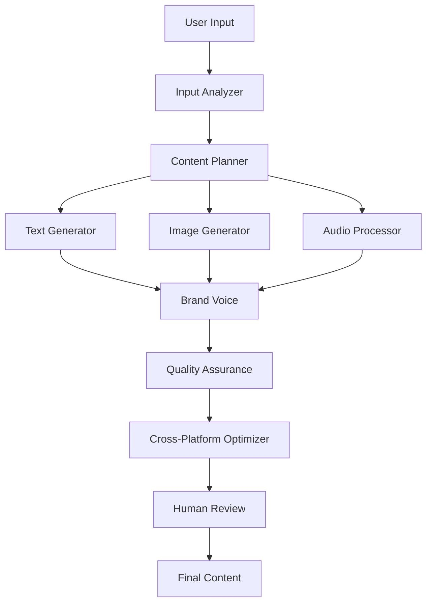
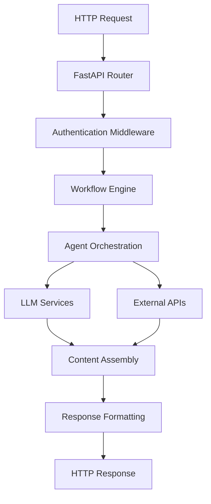

# ViraLearn ContentBot Architecture

A comprehensive overview of the ViraLearn ContentBot system architecture, components, and workflows.

## 🏗️ High-Level Overview

ViraLearn ContentBot is a sophisticated multi-agent content generation system built on modern Python technologies. The system leverages LangGraph for workflow orchestration, supports multiple LLM providers, and generates multimedia content across various platforms.

### Core Technologies
- **LangGraph**: Multi-agent workflow orchestration
- **FastAPI**: REST API framework
- **Streamlit**: Interactive web interface
- **PostgreSQL/SQLite**: Data persistence
- **Redis**: Caching and session management
- **Docker**: Containerization and deployment

## 🧩 System Components

### 1. Multi-Agent System (`src/agents/`)

The heart of the ContentBot is a collection of specialized agents that work together:

```
src/agents/
├── base_agent.py          # Abstract base class for all agents
├── input_analyzer.py      # Analyzes user input and requirements
├── content_planner.py     # Plans content structure and strategy
├── text_generator.py      # Generates text content using LLMs
├── image_generator.py     # Creates visual content
├── audio_processor.py     # Handles audio generation and processing
├── brand_voice.py         # Ensures consistent brand messaging
├── quality_assurance.py   # Reviews and validates content quality
├── cross_platform.py     # Adapts content for different platforms
├── human_review.py        # Manages human-in-the-loop workflows
└── workflow_coordinator.py # Orchestrates agent interactions
```

#### Agent Responsibilities

- **Input Analyzer**: Parses user requests, extracts requirements, determines content type
- **Content Planner**: Creates content outlines, defines structure, sets objectives
- **Text Generator**: Produces written content using configured LLM providers
- **Image Generator**: Creates visuals using Google Cloud Imagen or other services
- **Audio Processor**: Generates voice content and audio processing
- **Brand Voice**: Maintains consistency across all generated content
- **Quality Assurance**: Validates content quality, checks guidelines compliance
- **Cross-Platform**: Optimizes content for specific platforms (social media, web, etc.)
- **Human Review**: Facilitates human oversight and approval workflows
- **Workflow Coordinator**: Manages agent execution order and data flow

### 2. API Layer (`src/api/`)

```
src/api/
├── main.py                # FastAPI application entry point
├── middleware/            # Custom middleware components
│   ├── auth.py           # Authentication middleware
│   ├── cors.py           # CORS configuration
│   └── logging.py        # Request/response logging
└── routers/              # API route definitions
    ├── workflows.py      # Workflow management endpoints
    ├── content.py        # Content generation endpoints
    ├── agents.py         # Agent management endpoints
    └── health.py         # Health check endpoints
```

### 3. Core Engine (`src/core/`)

```
src/core/
├── workflow_engine.py     # LangGraph workflow orchestration
├── error_handling.py      # Global error handling and recovery
└── monitoring.py          # Performance monitoring and metrics
```

### 4. Data Models (`src/models/`)

```
src/models/
├── api_models.py          # API request/response models
├── content_models.py      # Content structure definitions
├── state_models.py        # Workflow state management
└── schemas.py             # Database schemas
```

### 5. External Services (`src/services/`)

```
src/services/
├── llm_service.py         # LLM provider integrations
├── image_service.py       # Image generation services
├── audio_service.py       # Audio processing services
└── database_service.py    # Database operations
```

### 6. Utilities (`src/utils/`)

```
src/utils/
├── config.py              # Configuration management
├── validators.py          # Input validation utilities
├── helpers.py             # Common helper functions
└── exceptions.py          # Custom exception classes
```

## 🔄 Data Flow Architecture

### Content Generation Workflow



### API Request Flow



## 🗄️ Database Architecture

### Schema Overview

```sql
-- Core Tables
CREATE TABLE workflows (
    id UUID PRIMARY KEY,
    name VARCHAR(255),
    status VARCHAR(50),
    created_at TIMESTAMP,
    updated_at TIMESTAMP
);

CREATE TABLE content_items (
    id UUID PRIMARY KEY,
    workflow_id UUID REFERENCES workflows(id),
    type VARCHAR(50),
    content TEXT,
    metadata JSONB,
    created_at TIMESTAMP
);

CREATE TABLE agent_executions (
    id UUID PRIMARY KEY,
    workflow_id UUID REFERENCES workflows(id),
    agent_name VARCHAR(100),
    status VARCHAR(50),
    input_data JSONB,
    output_data JSONB,
    execution_time INTEGER,
    created_at TIMESTAMP
);
```

### Data Storage Strategy

- **PostgreSQL**: Primary database for production environments
- **SQLite**: Development and testing database
- **Redis**: Session management, caching, and temporary data
- **File System**: Generated media files (images, audio)

## 🔌 External Integrations

### LLM Providers

1. **Google Gemini**
   - Primary text generation
   - Advanced reasoning capabilities
   - Multimodal understanding

2. **Mistral AI**
   - Alternative text generation
   - Specialized models for different tasks
   - European data compliance

3. **Hugging Face**
   - Open-source model access
   - Custom model fine-tuning
   - Diverse model ecosystem

### Google Cloud Services

1. **Imagen API**
   - High-quality image generation
   - Style transfer capabilities
   - Brand-consistent visuals

2. **Text-to-Speech API**
   - Natural voice synthesis
   - Multiple language support
   - Custom voice training

### Authentication & Security

- **JWT Tokens**: API authentication
- **Environment Variables**: Secure credential management
- **Rate Limiting**: API usage control
- **Input Validation**: Security against malicious inputs

## 🚀 Deployment Architecture

### Local Development

```bash
# Direct Python execution
python src/main.py

# Streamlit UI
streamlit run streamlit_app.py

# FastAPI server
uvicorn src.api.main:app --reload
```

### Docker Deployment

```yaml
# docker-compose.yml structure
services:
  contentbot:
    build: .
    ports:
      - "8000:8000"
    environment:
      - DATABASE_URL=postgresql://...
    depends_on:
      - postgres
      - redis

  postgres:
    image: postgres:15
    environment:
      - POSTGRES_DB=contentbot
    volumes:
      - postgres_data:/var/lib/postgresql/data

  redis:
    image: redis:7-alpine
    ports:
      - "6379:6379"
```

### Kubernetes Deployment

```yaml
# k8s-deployment.yaml highlights
apiVersion: apps/v1
kind: Deployment
metadata:
  name: contentbot
spec:
  replicas: 3
  selector:
    matchLabels:
      app: contentbot
  template:
    spec:
      containers:
      - name: contentbot
        image: contentbot:latest
        ports:
        - containerPort: 8000
        env:
        - name: DATABASE_URL
          valueFrom:
            secretKeyRef:
              name: contentbot-secrets
              key: database-url
```

## 🔧 Configuration Management

### Environment Variables

```python
# src/utils/config.py
class Settings(BaseSettings):
    # Database
    database_url: str = "sqlite:///./contentbot.db"
    redis_url: str = "redis://localhost:6379/0"
    
    # LLM Providers
    google_api_key: Optional[str] = None
    mistral_api_key: Optional[str] = None
    huggingface_api_token: Optional[str] = None
    
    # Google Cloud
    google_cloud_project_id: Optional[str] = None
    google_application_credentials: Optional[str] = None
    
    # Application
    primary_llm_provider: str = "gemini"
    fallback_llm_provider: str = "mistral"
    max_content_length: int = 10000
    
    class Config:
        env_file = ".env"
```

### Configuration Hierarchy

1. Environment variables (highest priority)
2. `.env` file
3. Default values in code
4. Runtime configuration updates

## 📊 Monitoring & Observability

### Metrics Collection

- **Agent Performance**: Execution time, success rate, error frequency
- **API Metrics**: Request count, response time, error rates
- **Resource Usage**: Memory consumption, CPU utilization
- **Content Quality**: User feedback, quality scores

### Logging Strategy

```python
# Structured logging example
logger.info(
    "Agent execution completed",
    extra={
        "agent_name": "text_generator",
        "workflow_id": workflow_id,
        "execution_time": execution_time,
        "tokens_used": token_count,
        "success": True
    }
)
```

## 🔒 Security Considerations

### Data Protection

- **API Key Management**: Secure storage and rotation
- **Input Sanitization**: Prevent injection attacks
- **Output Filtering**: Content safety and compliance
- **Access Control**: Role-based permissions

### Privacy Compliance

- **Data Minimization**: Store only necessary information
- **Retention Policies**: Automatic data cleanup
- **Audit Trails**: Track data access and modifications
- **Encryption**: Data at rest and in transit

## ⚡ Performance Optimization

### Caching Strategy

- **Redis Caching**: Frequently accessed data
- **LLM Response Caching**: Reduce API calls for similar requests
- **Image Caching**: Store generated images for reuse
- **Database Query Optimization**: Indexed queries and connection pooling

### Scalability Patterns

- **Horizontal Scaling**: Multiple application instances
- **Load Balancing**: Distribute requests across instances
- **Database Sharding**: Partition data for better performance
- **Async Processing**: Non-blocking operations for better throughput

## 🛠️ Development Guidelines

### Code Organization

- **Separation of Concerns**: Clear module boundaries
- **Dependency Injection**: Configurable service dependencies
- **Interface Abstractions**: Pluggable components
- **Error Handling**: Comprehensive exception management

### Testing Strategy

```
tests/
├── unit/                  # Unit tests for individual components
├── integration/           # Integration tests for workflows
├── performance/           # Load and performance tests
└── fixtures/              # Test data and mocks
```

### Code Quality

- **Type Hints**: Full type annotation coverage
- **Linting**: Black, flake8, mypy
- **Documentation**: Comprehensive docstrings
- **Code Reviews**: Peer review process

## 🔮 Future Enhancements

### Planned Features

1. **Advanced Analytics**: Content performance tracking
2. **Custom Model Training**: Fine-tuned models for specific use cases
3. **Multi-language Support**: Content generation in multiple languages
4. **Real-time Collaboration**: Multiple users working on content simultaneously
5. **Advanced Workflows**: Complex branching and conditional logic

### Technical Improvements

1. **GraphQL API**: More flexible data querying
2. **Event Sourcing**: Complete audit trail of all changes
3. **Microservices**: Break down into smaller, focused services
4. **Machine Learning Pipeline**: Automated content optimization
5. **Edge Computing**: Distributed content generation

## 🐛 Troubleshooting

### Common Issues

1. **Agent Execution Failures**
   - Check API key validity and quotas
   - Verify network connectivity
   - Review agent configuration

2. **Database Connection Issues**
   - Validate connection string
   - Check database server status
   - Verify credentials and permissions

3. **Performance Problems**
   - Monitor resource usage
   - Check for memory leaks
   - Optimize database queries

### Debug Mode

```bash
# Enable debug logging
export LOG_LEVEL=DEBUG

# Run with detailed output
python src/main.py --debug
```

## 📚 Additional Resources

- **LangGraph Documentation**: [Official LangGraph Docs](https://langchain-ai.github.io/langgraph/)
- **FastAPI Guide**: [FastAPI Documentation](https://fastapi.tiangolo.com/)
- **Streamlit Tutorials**: [Streamlit Documentation](https://docs.streamlit.io/)
- **Docker Best Practices**: [Docker Documentation](https://docs.docker.com/)

---

This architecture document provides a comprehensive overview of the ViraLearn ContentBot system. For specific implementation details, refer to the source code and inline documentation.